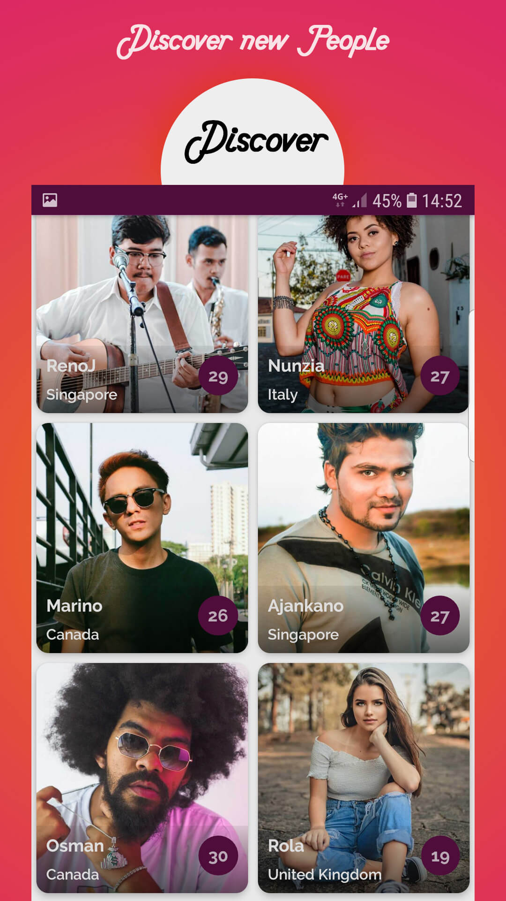

# 2Doz - Discover and Chat App for Android

2Doz is a mobile chat application for Android that enables you to discover and connect with people around the world. Engage in conversations using both voice and text messages, and explore a variety of features designed to enhance your social experience.

## Key Features

### 1. Swipe to Match
Quickly and intuitively swipe through profiles to match with interesting people. A simple and fun way to discover potential connections.

### 2. Show Nearby People
View a list of nearby people who are also using the app. Connect with users in your vicinity and expand your social circle.

### 3. Search for Nearby People
Use the search functionality to find specific individuals nearby. Customize your preferences and connect with people who share common interests.

### 4. Voice Calls
Once matched with someone, initiate voice calls for a more personal and interactive communication experience.

## Screenshots

  

 

 

 

  

<!-- Add more screenshots as needed -->

## Technologies Used

- **Language:** Java for Android
- **Database:** Google Firebase Firestore

## Getting Started

To get started with 2Doz, follow these steps:

1. Clone the repository to your local machine.
2. Open the project in Android Studio.
3. Connect the app to your Firebase project.
4. Build and run the app on an Android emulator or device.

## Contributing

Contributions are welcome! If you have suggestions, feature requests, or find any issues, feel free to open an [issue](link-to-issues) or submit a [pull request](link-to-pull-requests).

## License

This project is licensed under the [MIT License](LICENSE).

---

**Note:** Replace the placeholder text such as `screenshots/screenshot1.png`, `link-to-issues`, and `link-to-pull-requests` with the actual paths and links relevant to your project.

Feel free to modify and expand the README.md based on your project's specific details and requirements.
